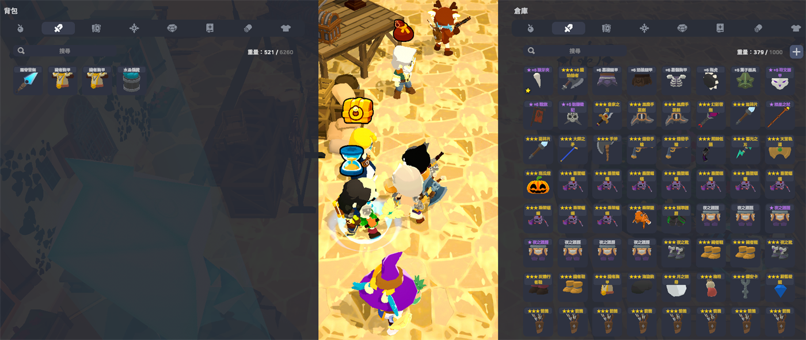
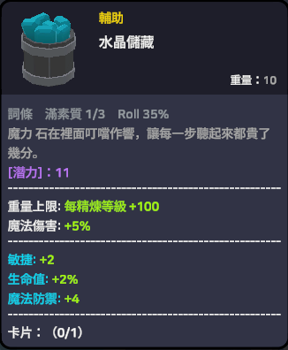
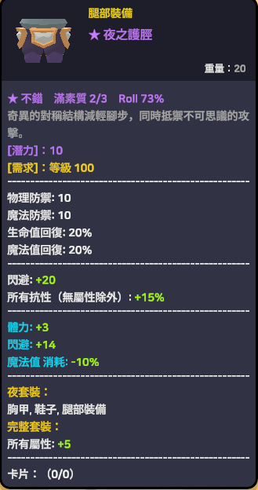
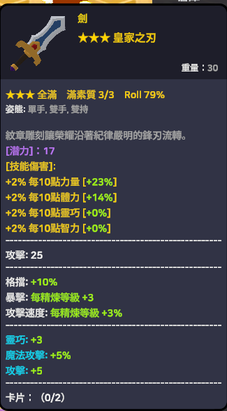
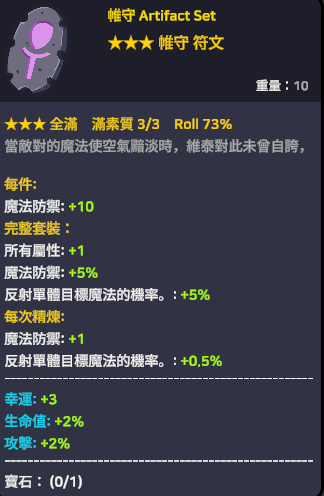
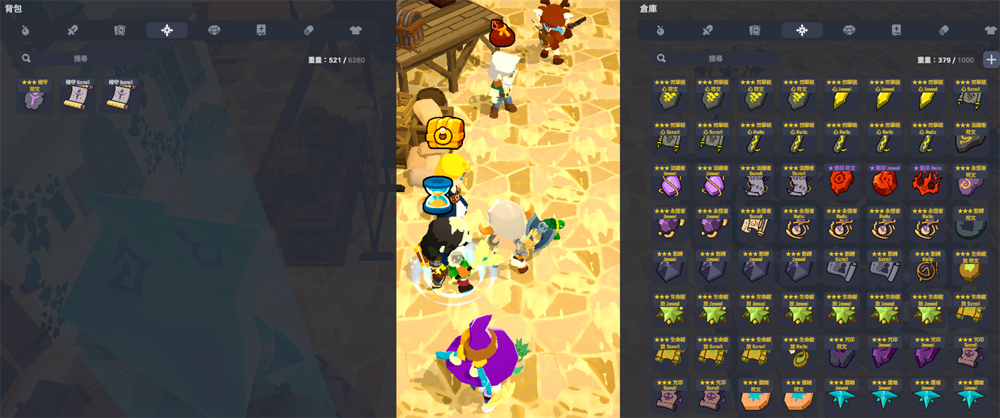

# SpiritVale 詞條品質快篩 HUD

> 讓《SpiritVale》裝備與神器的隨機詞條品質**一眼可見**，不必再逐件按 ALT 檢查。

[](LICENSE)
[](https://github.com/BepInEx/BepInEx)

---

## 這個 Mod 解決什麼問題

《SpiritVale》的裝備與神器各自帶有隨機詞條，每條詞條都在一個區間內隨機（例如 `力量 +2~3`）。
原本要判斷一件裝備好不好，**必須把滑鼠移上去、再按住 ALT** 才看得到數值區間，
整包背包幾十件要一件件檢查，非常耗時。

這個 Mod 直接在**背包格子的名稱前面加上星號並上色**，不必 hover、不必按鍵，
開背包的瞬間就知道哪幾件值得留。

## 效果展示

### 背包一眼篩選

不必 hover、不必按鍵，開背包的瞬間就看得出哪幾件值得留：



### 品質分級

| 未達標（不標記） | ★ 不錯 | ★★★ 全滿 |
|:---:|:---:|:---:|
|  |  |  |
| 滿素質 **1/3** · Roll 35% | 滿素質 **2/3** · Roll 73% | 滿素質 **3/3** · Roll 79% |

道具說明開頭那行的意義：

| 欄位 | 意義 |
|---|---|
| `★★★ 全滿` | 星級與評價，取決於「滿素質」比例 |
| `滿素質 3/3` | 有幾條詞條的數值**已達區間上限** |
| `Roll 79%` | 內部 roll 百分位平均，反映真實稀有度（見下方說明） |

### 神器同樣支援

神器的詞條結構與裝備一致，判定邏輯共用同一套核心：





---

## 前置需求

- 《SpiritVale》Windows 64 位元版
- **已安裝 BepInEx 6.x（IL2CPP 版）**

> 如果你已經安裝了「SpiritVale 繁體中文包」，BepInEx 就已經裝好了，可直接安裝本 Mod。
> 本 Mod 與繁體中文包**完全相容**，不會破壞翻譯。

---

## 安裝

### 方式一：一鍵安裝（建議）

1. 下載 [Releases](../../releases) 裡的便攜版壓縮檔，**完整解壓縮**到任意資料夾
2. **完全關閉遊戲**
3. 雙擊 `一鍵安裝.bat`，依畫面指示完成
4. 啟動遊戲即生效

安裝腳本會自動從登錄檔尋找 Steam 的遊戲位置，找不到時會請你貼上路徑。

### 方式二：手動安裝

把 `SpiritValeSubstatHUD.dll` 複製到：

```
<遊戲目錄>\BepInEx\plugins\SpiritValeSubstatHUD\
```

---

## 使用說明

裝好之後**不需要任何操作**，開背包就會看到星號。

### 星級標準

預設以「**滿素質**」為準 —— 也就是有幾條詞條的數值已經頂到區間上限：

| 標記 | 顏色 | 條件 |
|---|---|---|
| `★★★` | 金 | 100%（每一條都頂到上限） |
| `★★` | 橘 | ≥ 75% |
| `★` | 紫 | ≥ 50% |
| 無標記 | — | < 50% |

未達標的裝備**刻意不標記**，避免整個背包都是星星反而失去篩選意義。

### 「滿素質」與「Roll」有什麼不同

這是本 Mod 最需要理解的一點。

遊戲內部每條詞條有一個 **0~100 的 roll 值**，最終顯示的數值是由它換算而來。
但當詞條區間很窄時（例如 `2~3`，只差 1），**大量的 roll 值都會被四捨五入到同一個顯示值**：

```
roll  50  →  顯示 +3
roll 100  →  顯示 +3     ← 兩者看起來完全一樣
```

所以會出現「肉眼看起來全滿，Roll 卻只有 60%」的情況。**兩個數字都是對的**，只是在講不同的事：

- **滿素質** — 你實際看到、實際生效的數值是否已達上限（**預設用這個判定星級**）
- **Roll** — 內部稀有度。兩件都是「滿素質 3/3」時，Roll 較高的那件更稀有

如果你想改用 Roll 作為星級標準，在設定檔把 `以顯示滿值為準` 改成 `false` 即可。

---

## 設定

> ⚠️ **設定檔不在下載檔內，也不需要手動建立。**
> 它是由 BepInEx 在你**安裝完、第一次啟動遊戲**時自動生成的。
> 剛裝好還沒開過遊戲時找不到這個檔案是正常的。

調整設定的步驟：

1. 先開一次遊戲讓它生成設定檔，然後**完全關閉遊戲**
2. 用記事本開啟這個檔案：

   ```
   <遊戲目錄>\BepInEx\config\local.spiritvale.substathud.cfg
   ```

   Steam 預設路徑通常是：

   ```
   C:\Program Files (x86)\Steam\steamapps\common\SpiritVale\BepInEx\config\local.spiritvale.substathud.cfg
   ```

3. 修改後存檔，重新啟動遊戲即生效

便攜版壓縮檔內附有一份 `設定檔範例.cfg`，可先參考有哪些選項，
內容與自動生成的完全相同 —— 那份只是參考，不必複製到遊戲目錄。

設定檔本身每個項目都附有中文說明，以下為對照表。

### `[1.功能]`

| 項目 | 預設 | 說明 |
|---|---|---|
| `背包星號標記` | `true` | 在背包裝備名稱前加 ★ 並上色 |
| `彈窗顯示品質總評` | `true` | 道具說明開頭加一行品質總評 |
| `自動顯示詞條範圍` | `false` | 免按 ALT 一律顯示詞條區間。**見下方警告** |

> ⚠️ **關於「自動顯示詞條範圍」**
>
> 這個功能會與遊戲原本的「按鍵對比裝備」功能衝突，導致對比視窗**每幀重繪而閃爍**。
> 原因是遊戲內部用同一個狀態同時控制「顯示區間」與「重繪時機」，強制開啟會讓狀態機失步。
>
> 因此**預設關閉**。有了星號標記後通常也不需要它 —— 快速篩選靠星號，想細看某件時按 ALT 即可。

### `[2.分級門檻]`

| 項目 | 預設 | 說明 |
|---|---|---|
| `以顯示滿值為準` | `true` | `true` 用滿素質判定，`false` 用 Roll 判定 |
| `三星` | `1.00` | 達此比例標 ★★★ |
| `二星` | `0.75` | 達此比例標 ★★ |
| `一星` | `0.50` | 達此比例標 ★，低於此值不標記 |

想讓標記更稀有一點，把 `一星` 調高（例如 `0.67`）即可。

### `[3.診斷]`

| 項目 | 預設 | 說明 |
|---|---|---|
| `診斷模式` | `false` | 在道具說明印出每條詞條的執行期真值並寫入 log。僅供除錯 |

---

## 移除

雙擊 `一鍵移除.bat`，或直接刪除這個資料夾：

```
<遊戲目錄>\BepInEx\plugins\SpiritValeSubstatHUD\
```

本 Mod **只新增檔案，不覆蓋任何既有檔案**，移除後即完全回到安裝前的狀態。
遊戲本體、BepInEx 框架、其他 Mod 都不受影響。

如果移除後仍有問題，可以編輯遊戲目錄的 `doorstop_config.ini`，
把 `enabled = true` 改成 `false`，即可一次停用所有 Mod 回到原版。

---

## 常見問題

**Q：會不會破壞繁體中文包的翻譯？**

不會。背包標記加的是純符號（`★`）而非富文本標籤，翻譯 Mod 的字典查不到就會原樣返回。
顏色則是走 `TMP_Text.color` 屬性，完全不碰文字內容。

**Q：這算作弊嗎？會被封號嗎？**

本 Mod 是**純顯示端**：不修改任何數值、不送出封包、不碰存檔。
它只是把遊戲**已經算好、本來就會顯示給你看**的資訊，換一種方式呈現。

關於封鎖，官方團隊曾在 Discord 上回覆玩家提問（2026 年 8 月）：

> this is allowed but we are not responsible if anything happens to the player
> for using an unofficial tool. Every player is responsible for their own account.

意即**使用非官方工具目前是被允許的，但官方不提供任何保證或支援**。
詳見下方「關於官方立場」。

**Q：神器（Artifact）也支援嗎？**

支援。神器的詞條結構與裝備完全一致，判定邏輯共用。
神器的詞條區間是全域固定的三種（`2~3` / `1~2%` / `1~2%`）。

**Q：遊戲更新後失效了怎麼辦？**

Mod 的每個 patch 都有獨立的錯誤處理，遊戲改版時會**降級而非崩潰** ——
最壞情況是某個功能沒作用，不會讓遊戲開不起來。

查看 `BepInEx\LogOutput.log`，搜尋 `SubstatHUD` 就能看到哪個 patch 掛載失敗。
歡迎開 Issue 回報。

**Q：星號太多／太少？**

調整設定檔的 `[2.分級門檻]`。神器因為詞條區間窄，比裝備更容易達成「滿素質」，
如果覺得神器星號太浮濫，可以把 `以顯示滿值為準` 改成 `false` 改用 Roll 判定。

---

## 從原始碼建置

需要 [.NET SDK 8](https://dotnet.microsoft.com/download)。

```bash
dotnet build src/SpiritValeSubstatHUD.csproj -c Release
```

`src/SpiritValeSubstatHUD.csproj` 預設從以下位置尋找參考組件：

```
C:\Program Files (x86)\Steam\steamapps\common\SpiritVale
```

遊戲裝在別處的話，用參數指定：

```bash
dotnet build src/SpiritValeSubstatHUD.csproj -c Release -p:GameDir="D:\Games\SpiritVale"
```

> 建置前請**先執行過一次遊戲**，讓 BepInEx 生成 `BepInEx\interop\` 底下的 interop assemblies，
> 那是編譯時的參考來源。

---

## 技術文件

如果你想學這套技術，或想做自己的 IL2CPP 遊戲 Mod：

📄 **[如何取得遊戲內正確數值](docs/如何取得遊戲內正確數值.md)**

內容包含：

- BepInEx / Il2CppInterop / Harmony 的技術鏈如何運作
- 四種取值方式的可靠度比較（含實例對錯）
- 三種驗證數值正確性的方法
- 不裝反編譯器，用 BepInEx 自帶的 Mono.Cecil 分析遊戲組件
- Harmony patch 的兩個實務陷阱
- **完整踩坑記錄**：同一個值錯三次的過程與原因

`docs/分析腳本/` 底下有 6 支可直接執行的 PowerShell 分析腳本，
遊戲改版後重跑就能比對出哪些型別變了。

---

## 更新紀錄

| 版本 | 日期 | 重點 |
|---|---|---|
| **1.3.1** | 2026-08-05 | 附上設定檔範例、補充官方立場說明、加入展示圖<br>（僅文件調整，功能與 1.3.0 相同） |
| **1.3.0** | 2026-08-03 | **神器（Artifact）支援**；修正背包星號完全沒出現的問題 |
| **1.2.0** | 2026-08-03 | **星級改以「滿素質」判定**；修正減益類詞條的判定方向 |
| **1.1.0** | 2026-08-03 | **修正品質判定完全錯誤** —— `Value` 是 roll 百分位而非數值；背包改用 ★ 記號 |
| **1.0.0** | 2026-08-02 | 首個版本 |

<details>
<summary>展開看每個版本改了什麼、以及為什麼</summary>

### 1.3.1 — 文件與封裝
- 便攜版附上 `設定檔範例.cfg`，安裝前就能看到有哪些選項
- 補上「關於官方立場」章節
- **修正**：設定說明沒講清楚 `.cfg` 是「首次啟動遊戲後才自動生成」，
  導致玩家以為壓縮檔漏檔
- **修正**：專案檔的 `AssemblyVersion` 一直停在 1.0.0

### 1.3.0 — 神器支援
- **新增**：神器（Artifact）支援。其詞條結構與裝備一致，判定邏輯共用同一套核心
- **修正**：背包星號完全沒出現 —— 背包實際走的是 `Draw(IInfoDrawable, bool)`
  泛型入口，原本只 patch `Draw(EquipData, bool)` 根本攔不到
- **修正**：所有 `LogDebug` 改為 `LogWarning`。BepInEx 預設的 `LogLevels`
  不含 `Debug`，導致除錯階段所有例外訊息被靜靜吞掉

### 1.2.0 — 改用「滿素質」判定
- **變更**：星級改以「有幾條詞條的實際數值已達區間上限」判定，
  也就是玩家肉眼看到的「滿」
- **變更**：顯示值一律取自 `Formula.GetSubstats()`（遊戲自己算好的結果），
  不再自行用 min/max 內插推算 —— 實測證明內插推不準
- **修正**：減益類詞條的判定方向。`MpCost` 這類詞條的區間是
  `min=-7, max=-10`（上限比下限小），原本的比較式會誤判成滿值

### 1.1.0 — 修正品質判定
- **修正**：品質判定完全錯誤。`StatData.Value` 並非詞條數值，
  而是 **0~100 的 roll 百分位**；原本用 `(Value - min) / (max - min)` 計算，
  會算出遠大於 1 的值並被 clamp 成 100%，導致每件裝備都顯示「滿值」
- **變更**：背包標記從「僅上色」改為名稱前加 ★ 記號並上色
- **變更**：`自動顯示詞條範圍` 改為預設關閉 —— 它會與遊戲的按鍵對比功能衝突，
  導致對比視窗每幀重繪而閃爍

### 1.0.0 — 首個版本
- 背包裝備依詞條品質上色
- 道具說明加入品質總評
- 道具說明自動顯示詞條區間（免按 ALT）

</details>

完整紀錄見 [CHANGELOG.md](CHANGELOG.md)。

---

## 授權

[MIT License](LICENSE)

本專案為非官方的第三方 Mod，與《SpiritVale》開發商及發行商**無任何關聯**。
使用風險請自行承擔。

### 關於官方立場

2026 年 8 月，有玩家就非官方工具（漢化包、詞條小工具）向官方團隊提問，
SPR 團隊成員於 Discord 回覆：

> Okay well, this is allowed but we are not responsible if anything happens
> to the player for using an unofficial tool.
> Every player is responsible for their own account~
>
> — Brilett（SPR 團隊）

歸納重點：

- 使用非官方工具**目前是被允許的**
- 但官方**不提供任何保證或支援**
- 若因使用而導致帳號問題、資料遺失、遊戲異常等狀況，**責任由玩家自行承擔**

> ⚠️ 這是當時的即時問答回覆，**並非官方正式公告，也不代表官方認可或背書本專案**。
> 官方立場可能隨時調整，使用前請自行確認最新規範。

本 Mod 不包含、不散布任何遊戲本體檔案，亦不包含 BepInEx 框架
（BepInEx 採 LGPL-2.1 授權，請自行從[官方專案](https://github.com/BepInEx/BepInEx)取得）。
